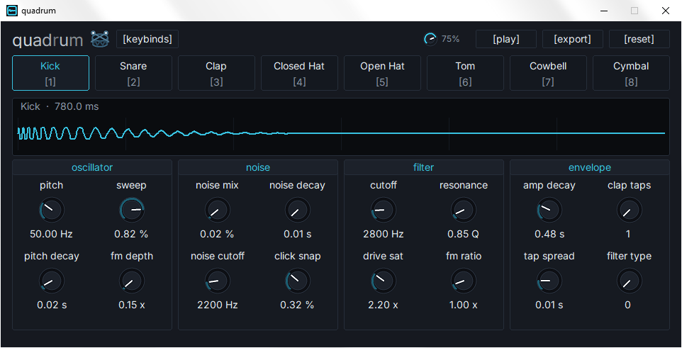

  

<h2 align="center">quadrum</h2>

  8-voice procedural virtual analog drum synthesizer

---

  

---

### input/output

| Signal | Description |
| :--- | :--- |
| **Key Input** | On-screen pads and 1-8 keyboard input |
| **Audio Output** | 44.1 kHz `Mono` to default Windows audio device |

---

### shortcuts

| Key / Command | Action |
| :--- | :--- |
| `1` .. `8` | Select and trigger corresponding drum voice |
| `Space` / `Enter` | Trigger currently selected voice |
| `E` | Open export dialog to 32-bit float WAV |
| `K` | Open keybinds window |
| `Esc` | Close window / Exit |

---

### controls

| Control | Description |
| :--- | :--- |
| **On-Screen Buttons** | Click buttons 1-8 to play drums |
| **Knobs** | Drag vertically to adjust; hold `Shift` for fine tuning |
| **Mouse Wheel** | Hover and scroll; `Shift` for finer steps |
| **Master Dial** | Global output volume |
| **Voice Pads** | Click to select and audition a drum voice |
| **Play** | Retrigger the active voice and scope |
| **Export** | Save current voice as 32-bit float WAV |
| **Reset** | Reset current voice to factory defaults |
| **Keybinds** | Open keybinds window |

---

### features

| Component | Description |
| :--- | :--- |
| **8 Procedural Engines** | Algorithmic models for Kick, Snare, Clap, Closed/Open Hat, Tom, Cowbell, Cymbal with FM, noise, filter, and envelopes |
| **16-Parameter Matrix** | Unified controls for pitch, sweep, FM, decays, noise, click, flam, filter cutoff/Q, and overdrive |
| **Sub-Sample DSP** | Biquad filtering, 64-bit PRNG noise, and cubic-Hermite soft saturation |
| **Denormal-Free** | FTZ/DAZ and SIMD-friendly processing (SSE2) for stable CPU usage |
| **Flam Burst Generator** | 1-5 staggered transients with spread and decay for clap sounds |
| **Vectorized Audio** | Low-latency mixer with 4-wide parallel accumulation and packed PCM16 output |
| **Asynchronous Rendering** | Background WAV export without UI blocking |
